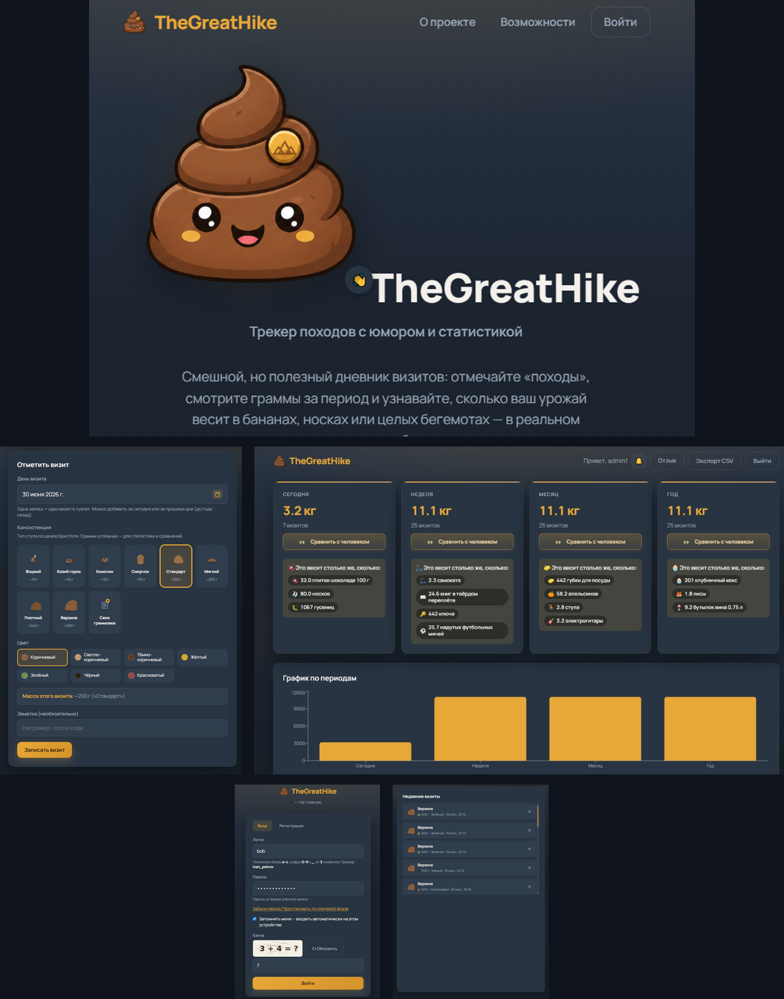
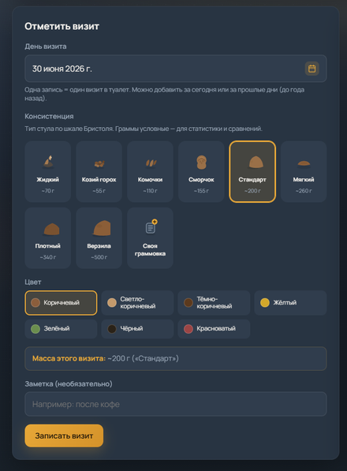
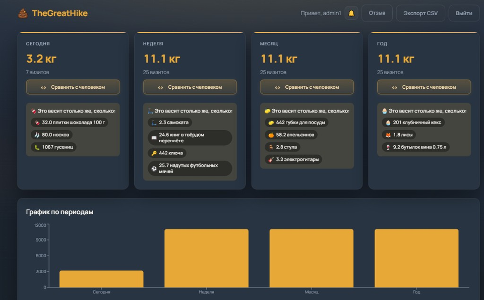
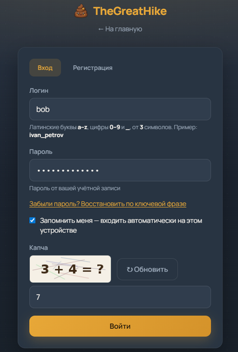
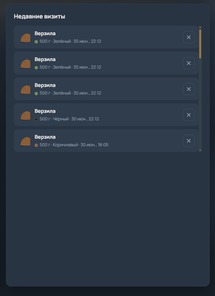

# TheGreatHike

Трекер визитов в туалет: записи, статистика по периодам, сравнения с предметами (бананы, слоны и т.п.).

<p align="center">
  
</p>

## Возможности

- Отметка визита: консистенция по шкале Бристоля, цвет, дата, заметка
- Статистика: день, неделя, месяц, год — граммы, визиты, график
- Сравнения с предметами и человеком в реальном масштабе
- Журнал недавних визитов
- Экспорт CSV
- Регистрация, вход, «запомнить меня», восстановление пароля по ключевой фразе

## Интерфейс

<p align="center">
  
</p>

| | |
|:---:|:---:|
| **Запись визита** — шкала Бристоля, цвет, масса | **Статистика** — периоды, сравнения, график |
|  |  |
| **Вход** — капча, восстановление пароля | **Журнал** — недавние визиты |
|  |  |

## Запуск

Нужны [Docker](https://www.docker.com/) и Docker Compose.

```bash
git clone https://github.com/IAMBloodSUCKER/TheGreatHike.git
cd TheGreatHike
docker compose up --build -d
```

Сайт: **http://localhost:3000**

PostgreSQL снаружи: `localhost:5433`, БД `thegreathike`, пользователь и пароль `thegreathike`.

Остановка:

```bash
docker compose down
```

## Шкала объёма

| Уровень   | ~грамм |
|-----------|--------|
| Крошка    | 50     |
| Малютка   | 100    |
| Стандарт  | 200    |
| Богатырь  | 350    |
| Верзила   | 500    |

Значения условные, для визуализации.

## Дисклеймер

Не медицинский продукт. При проблемах со здоровьем — к врачу.

## Разработка

См. [`docs/`](docs/).

## Лицензия

MIT
