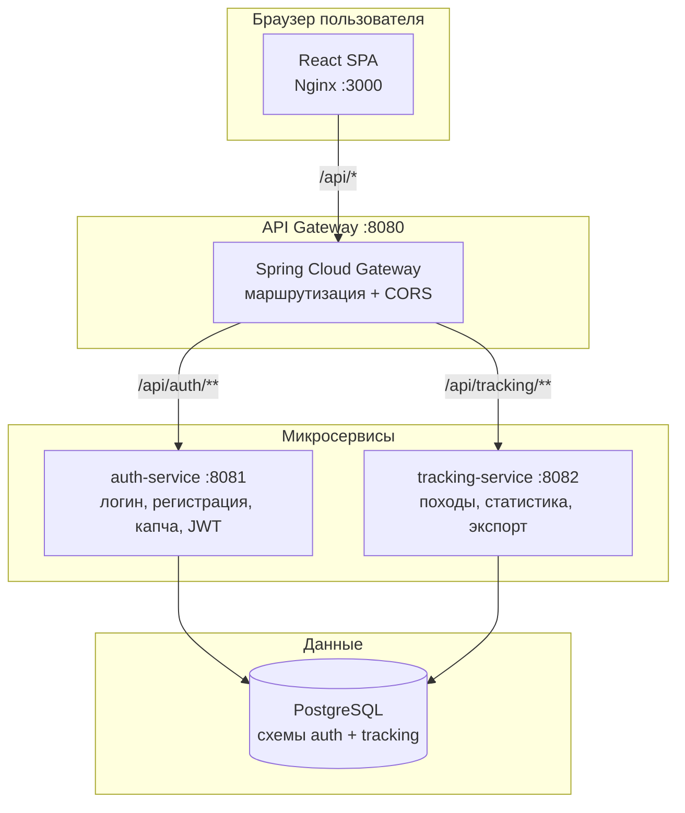
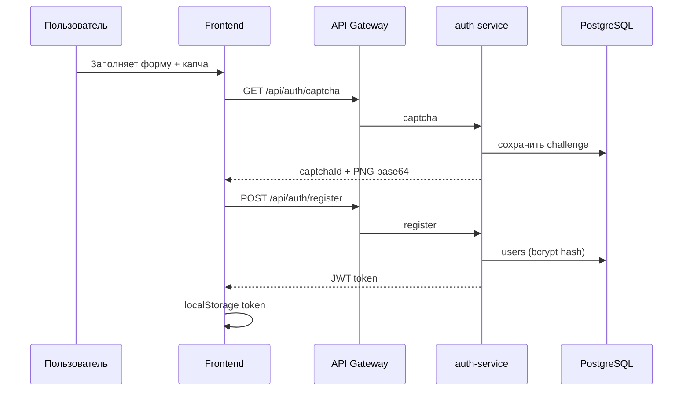
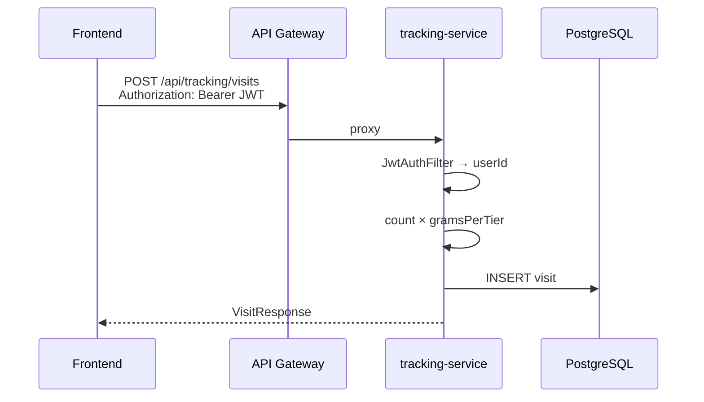
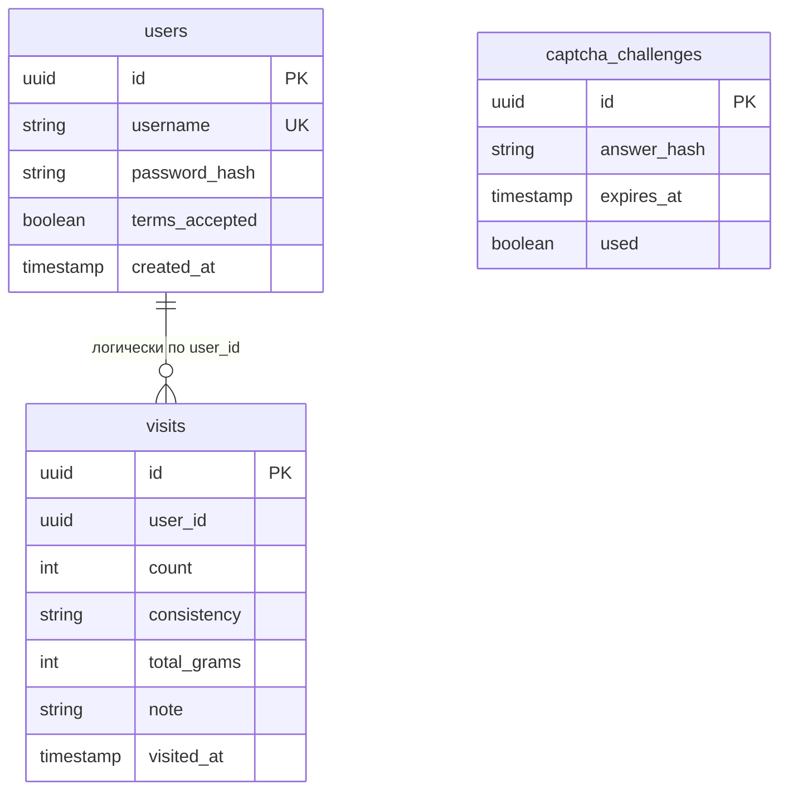

# Архитектура TheGreatHike

## Обзор

TheGreatHike — микросервисное веб-приложение из трёх backend-сервисов, единой точки входа (API Gateway), SPA-фронтенда и PostgreSQL.

## Поток запросов

### Регистрация / вход

### Отметка похода

## Сервисы

| Сервис | Порт | Ответственность |
|--------|------|-----------------|
| **frontend** | 3000 (80 в контейнере) | UI, прокси `/api` → gateway |
| **api-gateway** | 8080 | Единая точка API, CORS |
| **auth-service** | 8081 | Регистрация, вход, капча, JWT, пользовательское соглашение |
| **tracking-service** | 8082 | CRUD походов, агрегация статистики, fun facts, CSV-экспорт |
| **postgres** | 5432 | Хранение данных |

## Схема БД

Схемы PostgreSQL разделены: `auth.*` и `tracking.*`.

## Безопасность

- Пароли — **BCrypt**, в БД только хэш
- API tracking защищён **JWT** (тот же секрет, что в auth-service)
- Капча одноразовая, TTL 5 минут
- Данные не уходят во внешние сервисы

## Масштабирование

Каждый микросервис — отдельный Docker-образ. Можно горизонтально масштабировать `auth-service` и `tracking-service` за балансировщиком, gateway маршрутизирует по `AUTH_SERVICE_URL` / `TRACKING_SERVICE_URL`.

## Стек

- Java 21, Spring Boot 3.3, Spring Cloud Gateway
- React 18, Vite, Recharts
- PostgreSQL 16
- Docker Compose
